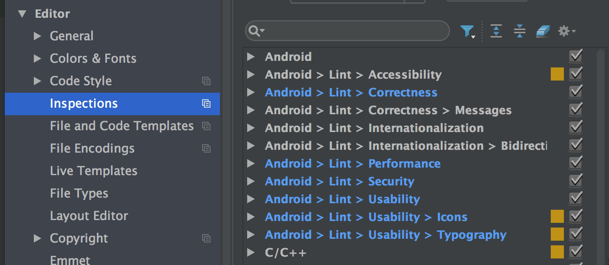

# Optimizing Layout Hierarchies 
[link](https://developer.android.com/training/improving-layouts/optimizing-layout.html)

> It is a common misconception that using the basic layout structures leads to the most efficient layouts. However, each widget and layout you add to your application requires initialization, layout, and drawing.

<!-- TOC -->

- [Optimizing Layout Hierarchies](#optimizing-layout-hierarchies)
    - [Inspect Your Layout](#inspect-your-layout)
    - [Revise Your Layout](#revise-your-layout)
    - [Use Lint.](#use-lint)
- [Re-using Layouts with `<include/>`](#re-using-layouts-with-include)
- [Loading Views On Demand](#loading-views-on-demand)
    - [Define a ViewStub](#define-a-viewstub)
    - [Load the ViewStub Layout](#load-the-viewstub-layout)
- [Making ListView Scrolling Smooth](#making-listview-scrolling-smooth)
    - [Use a Background Thread](#use-a-background-thread)
    - [Hold View Objects in a View Holder](#hold-view-objects-in-a-view-holder)

<!-- /TOC -->

## Inspect Your Layout

Android SDK include [`Hierarchy Viewer`](https://developer.android.com/tools/help/hierarchy-viewer.html) that helps you to analyze layout during runtime. 

Refer to [this link](https://developer.android.com/studio/profile/hierarchy-viewer-walkthru.html#WorkingWithHierarchyViewer) for more details. Note that I've tried to showcase the hierarchy viewer but it was not easy to do so. Some claims that it only works with google device and needs some extended configuration in order to work with 3rd party devices.

## Revise Your Layout

Try to flatten your layout - try to make your layout as shallow (less nesting) as possible. 

And note that `layout_weight` is an expensive method.

## Use Lint.

Enable at `Settings` -> `Editor` -> `Inspections`.

]

You can also use lint testing in terminal. For example,

`lint main` will show below outputs

```
cjeon:src cjeon$ lint main

Scanning main: ...............................
Scanning main (Phase 2): ................
main: Error: No .class files were found in project "main", so none of the classfile based checks could be run. Does the project need to be built first? [LintError]
AndroidManifest.xml: Warning: Manifest should specify a minimum API level with <uses-sdk android:minSdkVersion="?" />; if it really supports all versions of Android set it to 1. [UsesMinSdkAttributes]
AndroidManifest.xml:8: Warning: Attribute allowBackup is only used in API level 4 and higher (current min is 1) [UnusedAttribute]
        android:allowBackup="true"
        ~~~~~~~~~~~~~~~~~~~~~~~~~~
res/layout/activity_main.xml:24: Warning: Attribute onClick is only used in API level 4 and higher (current min is 1) [UnusedAttribute]
            android:onClick= "localBroadcastWithService"
            ~~~~~~~~~~~~~~~~~~~~~~~~~~~~~~~~~~~~~~~~~~~~
res/layout/activity_main.xml:31: Warning: Attribute onClick is only used in API level 4 and higher (current min is 1) [UnusedAttribute]
            android:onClick= "globalBroadcastWithAlarmManager"
            ~~~~~~~~~~~~~~~~~~~~~~~~~~~~~~~~~~~~~~~~~~~~~~~~~~
res/layout/activity_main.xml:38: Warning: Attribute onClick is only used in API level 4 and higher (current min is 1) [UnusedAttribute]
            android:onClick= "setAlarm"
            ~~~~~~~~~~~~~~~~~~~~~~~~~~~
AndroidManifest.xml:2: Warning: Should set android:versionCode to specify the application version [MissingVersion]
<manifest xmlns:android="http://schemas.android.com/apk/res/android"
^
AndroidManifest.xml:2: Warning: Should set android:versionName to specify the application version [MissingVersion]
<manifest xmlns:android="http://schemas.android.com/apk/res/android"
^
res/layout/activity_main.xml:3: Warning: The resource R.layout.activity_main appears to be unused [UnusedResources]
<android.support.design.widget.CoordinatorLayout
^
res/values/dimens.xml:3: Warning: The resource R.dimen.activity_horizontal_margin appears to be unused [UnusedResources]
    <dimen name="activity_horizontal_margin">16dp</dimen>
           ~~~~~~~~~~~~~~~~~~~~~~~~~~~~~~~~~
res/values/dimens.xml:4: Warning: The resource R.dimen.activity_vertical_margin appears to be unused [UnusedResources]
    <dimen name="activity_vertical_margin">16dp</dimen>
           ~~~~~~~~~~~~~~~~~~~~~~~~~~~~~~~
res/drawable-hdpi/ic_account_balance_black_24dp.png: Warning: The resource R.drawable.ic_account_balance_black_24dp appears to be unused [UnusedResources]
AndroidManifest.xml:7: Warning: App is not indexable by Google Search; consider adding at least one Activity with an ACTION-VIEW intent-filler. See issue explanation for more details. [GoogleAppIndexingWarning]
    <application
    ^
AndroidManifest.xml:11: Warning: You must set android:targetSdkVersion to at least 17 when enabling RTL support (is -1) [RtlEnabled]
        android:supportsRtl="true"
                             ~~~~
1 errors, 13 warnings
```

# Re-using Layouts with `<include/>`

You can use `<include/>` and `<merge/>` 

* `<include/>`: copy-paste the whole code.
* `<merge/>`: copy-paste the child of `<merge/>`

File to be included looks like below:

``` xml
<LinearLayout>
    <SomeChild/>
<LinearLayout>
```

while file to be merged looks like below:

``` xml
<merge xmlns:android="http://schemas.android.com/apk/res/android">
    <SomeChild/>
</merge>
```

When reused, `include` will include one `LinearLayout` and `SomeChild`. `Merge` will include only `SomeChild`. It helps to minimize redundant layouts.


# Loading Views On Demand

> Sometimes your layout might require complex views that are rarely used ... you can reduce memory usage and speed up rendering by loading the views only when they are needed.

## Define a ViewStub

> ViewStub is a lightweight view with no dimension and doesn’t draw anything or participate in the layout. As such, it's cheap to inflate and cheap to leave in a view hierarchy.

``` xml
<ViewStub
    android:id="@+id/stub_import"
    android:inflatedId="@+id/panel_import"
    android:layout="@layout/progress_overlay"
    android:layout_width="fill_parent"
    android:layout_height="wrap_content"
    android:layout_gravity="bottom" />
```

## Load the ViewStub Layout

``` java
((ViewStub) findViewById(R.id.stub_import)).setVisibility(View.VISIBLE);
// or
View importPanel = ((ViewStub) findViewById(R.id.stub_import)).inflate();
```

> Note: One drawback of ViewStub is that it doesn’t currently support the <merge> tag in the layouts to be inflated.

# Making ListView Scrolling Smooth

> The key to a smoothly scrolling ListView is to keep the application’s main thread (the UI thread) free from heavy processing.

## Use a Background Thread

Use `AsyncTask`.

## Hold View Objects in a View Holder

> Your code might call findViewById() frequently during the scrolling of ListView, which can slow down performance. (...) A way around repeated use of findViewById() is to use the "view holder" design pattern.

``` java
static class ViewHolder {
  TextView text;
  TextView timestamp;
  ImageView icon;
  ProgressBar progress;
  int position;
}
```

or you can also use `@injectView` and other libraries.


